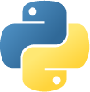

# Hello!

Welcome to my Github Profile!

It is still under work right now, so the information here is incomplete.

### Interests
- 🥖 garlic bread
- ⚽️&🎾
- 📊 machine learning

### Languages

### Frameworks

